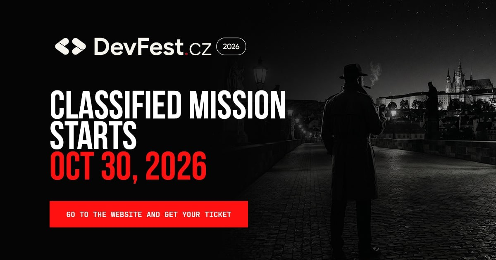

# DevFest.cz 2026

The most original developer conference in Prague is back.



DevFest.cz 2026 is a community-built conference and festival for developers, geeks, and tech enthusiasts focusing on Web/Mobile Development, Cybersecurity, AI/ML, and more — happening **October 30, 2026** in Prague, Czech Republic.

## Tech Stack

- **Framework:** [Astro](https://astro.build/) 6
- **Language:** TypeScript (strict mode)
- **Styling:** Sass
- **UI:** React 19 (interactive islands)
- **Backend:** Firebase
- **Node:** >= 22.12.0

## Getting Started

```bash
# Install dependencies
npm install

# Start development server
npm run dev

# Build for production
npm run build

# Preview production build
npm run preview
```

## ti.to Tickets — Cloud Functions + RTDB cache

The "Get your ticket" section is rendered client-side from a Firebase Realtime Database cache. The static build never calls ti.to, and a scheduled Cloud Function keeps the cache fresh.

```
Cloud Scheduler (every 1 h, Europe/Prague)
  └─> Cloud Function `refreshTitoCache` (europe-west1)
        ├─ fetch  https://api.tito.io/v3/<acc>/<evt>/releases
        └─ write  RTDB /tickets = { releases, accountSlug, eventSlug, fetchedAt }

Browser
  └─> Tickets.tsx (client:load)
        └─ subscribe RTDB /tickets via firebase/database onValue
```

The Blaze plan is required for scheduled functions and Secret Manager.

> **Shared Firebase project.** `devfest-cz-app` also hosts the mobile app's Cloud Functions from a separate repo. This repo declares `"codebase": "website"` in `firebase.json` so deploys here only touch our own functions. The app repo must use a different codebase name and avoid colliding function names.

### Configure & deploy the functions

```bash
# Install function deps
npm --prefix functions install

# Set secrets (one-time each)
firebase functions:secrets:set TITO_API_TOKEN          # ti.to admin API
firebase functions:secrets:set TITO_WEBHOOK_SECRET     # ti.to webhook security token
firebase functions:secrets:set SLACK_WEBHOOK_URL       # Slack incoming-webhook URL

# Set ti.to slugs as non-secret params (functions/.env)
echo 'TITO_ACCOUNT_SLUG=your-account' >> functions/.env
echo 'TITO_EVENT_SLUG=your-event'      >> functions/.env

# Deploy
firebase deploy --only functions
```

The default Cloud Functions service account has the IAM needed to write RTDB; no extra service-account JSON is required at runtime.

### Functions

| Name | Trigger | Purpose |
| ---- | ------- | ------- |
| `refreshTitoCache` | Cloud Scheduler, hourly | Sync ti.to releases → RTDB `/tickets` |
| `titoWebhook` | HTTPS, public | Verifies `Tito-Signature` and posts purchase notifications to Slack |
| `weeklyTicketStatus` | Cloud Scheduler, Mondays `09:00 Europe/Prague` | Fetches live releases from ti.to and posts a sales summary to Slack |
| `thursdayTicketStatus` | Cloud Scheduler, Thursdays `18:00 Europe/Prague` | Same handler as `weeklyTicketStatus` — second weekly status report |

Wire up the webhook in ti.to → Customize → Webhook Endpoints:
1. Paste the deployed `titoWebhook` URL.
2. Copy ti.to's security token into `TITO_WEBHOOK_SECRET` (Secret Manager).
3. Subscribe to `registration.finished` — that event fires once per completed order and already lists every ticket in the registration, so subscribing to `ticket.completed` as well would double-post.

### RTDB rules

`database.rules.json` documents the required rules. Either paste it into the Firebase console, or add `"database": { "rules": "database.rules.json" }` to `firebase.json` and run `firebase deploy --only database`.

While the Tickets section is hidden on the site, `/tickets` is locked down (`.read: false`) so the cache cannot be pulled from outside. The Cloud Functions still write to it via the Admin SDK (which bypasses rules). When the site is ready to launch, flip `tickets.".read"` to `true` and re-deploy / re-paste the rules.

### App Check

App Check attests that RTDB reads come from the real site, not a scraper. The
web client uses **reCAPTCHA Enterprise** in `src/lib/firebase.ts` with the key
committed (`APPCHECK_SITE_KEY` — public, like the Firebase `apiKey`). App Check
tokens already attach to RTDB reads; reads keep working until you toggle
enforcement on, so it's safe to ship before enforcing.

**Scope.** Only the public surface needs it: RTDB `/tickets`, which the browser
reads directly. The `titoWebhook` function is called by ti.to (an external
server that cannot mint an App Check token) and is already protected by an HMAC
signature — **do not** enforce App Check on it. The scheduled functions take no
public traffic, so App Check is irrelevant there.

Remaining steps (do 1–3 before turning on enforcement):

1. **Register the key in Firebase App Check.** GCP console (project
   `devfest-cz-app`) → Security → reCAPTCHA holds the **score-based website key**
   (`6Ld…WChra`); add `devfest.cz` and any preview domains to its allowed
   domains. Then Firebase console → App Check → Apps: register the web app and
   point it at that reCAPTCHA Enterprise key. (Per-environment override: set
   `PUBLIC_FIREBASE_APPCHECK_SITE_KEY` in `.env` to use a different key ID.)
2. **Local dev.** Set `PUBLIC_FIREBASE_APPCHECK_DEBUG_TOKEN=true` in `.env`, load
   the site, copy the debug token from the console, and register it under
   App Check → Apps → Manage debug tokens. Leave this empty in production.
3. **Watch metrics.** With tokens flowing but enforcement still off, App Check →
   APIs shows the verified-vs-unverified split for Realtime Database. Wait until
   nearly all real traffic is verified.
4. **Enforce.** Once the metrics look clean, turn on enforcement for **Realtime
   Database** in App Check → APIs. This is a console toggle — no code or
   `database.rules.json` change. Leave Cloud Functions enforcement off.

### Filtering

Only releases that are on sale or sold out are displayed. Archived, secret, expired, upcoming, paused (`off_sale` / `locked`) releases are dropped server-side before writing to RTDB, with the same predicate applied again client-side as defence-in-depth. A single `sale_status` string is synthesised from ti.to's flag set (`sold_out`, `off_sale`, `expired`, `upcoming`, `archived`, `locked`) — see `functions/src/tickets/tito-api.ts::deriveSaleStatus`.

## Project Structure

```
src/
  pages/        # File-based routing (.astro pages)
  components/   # Reusable UI components
  layouts/      # Page layouts
public/         # Static assets (images, favicon, etc.)
astro.config.mjs
tsconfig.json
```

## Key Pages

| Route | Description |
|-------|-------------|
| `/` | Landing page with countdown and newsletter signup |
| `/privacy-policy` | GDPR privacy policy |
| `/newsletter-subscription-thank-you` | Post-signup confirmation |

## Links

- Website: [devfest.cz](https://devfest.cz)
- Last year's edition: [2025.devfest.cz](https://2025.devfest.cz)
