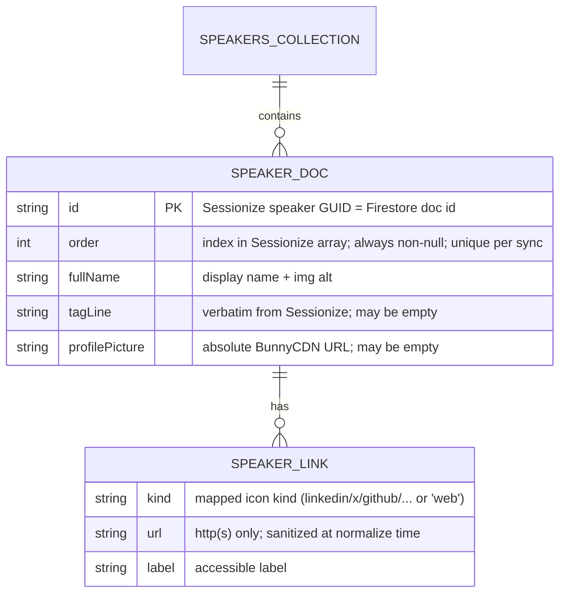

## Add /speakers lineup page sourced from Sessionize — Standard

## Overview

A dedicated `/speakers` page for DevFest.cz 2026 rendering the confirmed speaker
lineup as a film-noir photo grid that mirrors the approved `/team` crew-card
treatment. Cards are static and short: headshot, name, tagline, social links —
**no** bio modal, no per-speaker detail view, no session/agenda data.

Speaker data flows one way: **Sessionize → Cloud Function → Firestore → browser.**
A daily scheduled Cloud Function (`refreshSpeakers`) fetches the Sessionize
Speakers view, normalizes it, and upserts documents into a public-read Firestore
`speakers` collection (deleting stale docs). The `Speakers.tsx` React island
subscribes live to that collection. Headshots are served directly from
Sessionize's BunnyCDN; the noir black-and-white look is a CSS `grayscale` filter,
not Firebase Storage.

This is a near-exact copy of the existing `refreshTitoCache` → RTDB `/tickets` →
`Tickets.tsx` pipeline, with one deliberate divergence: the datastore is
**Firestore** (already provisioned for `invoices`) instead of RTDB, chosen for
structured per-speaker docs and reliable ordering via an explicit `order` field.

## Problem Statement / Motivation

The site has no way to show who is speaking. The org already maintains the speaker
roster in Sessionize (its source of truth). Hand-maintaining a static TS array
(as `/team` does) would drift from Sessionize and require a code change per
speaker. Mirroring Sessionize into Firestore on a daily schedule keeps the site in
sync with zero manual edits, reusing a pipeline shape the codebase already proves
out for tickets.

## Proposed Solution

Three layers, built in the phase order below so the codebase compiles after each:

1. **Write side** — new `functions/src/speakers/` domain mirroring
   `functions/src/tickets/`: `params.ts` (Sessionize endpoint id secret),
   `sessionize-api.ts` (fetch + validate + normalize the Speakers view),
   `refresh-speakers.ts` (`onSchedule` daily, upsert Firestore + guarded
   stale-delete), `index.ts` barrel, plus `export *` from `functions/src/index.ts`.
2. **Read plumbing** — scoped public read on `speakers` in `firestore.rules`;
   `getFirestore` added to `src/lib/firebase.ts` on the existing App-Check app;
   `src/lib/speakers.ts` with browser-safe types + `linkType`→icon map + helpers.
3. **UI** — `Speakers.tsx` island (`client:load`) reading Firestore live,
   `src/pages/speakers.astro` page + `speakers.scss` reusing the `/team` grid, a
   nav entry in `Menu.astro`, and a `<noscript>` fallback.

### Normalized Firestore document schema



`links[]` is stored as an array field on the doc (not a subcollection). Fields
deliberately dropped from the normalized doc: `bio`, `sessions`, `questionAnswers`,
`categories`, `isTopSpeaker` (YAGNI — ordering is pure Sessionize index; nothing
features top speakers).

### `refreshSpeakers` sync algorithm (guarded)

Fetch/validate/normalize and the delete-guard computation live as **pure,
exported functions** in `sessionize-api.ts` (mirroring how `tito-api.ts` exports
`fetchAllReleases`/`isWebsiteVisible`/`projectRelease`), so the highest-risk logic
is reviewable in isolation — the repo ships no tests, so pure functions are the
verification surface.

```
1. id = SESSIONIZE_ENDPOINT_ID.value(); build URL
   https://sessionize.com/api/v2/{id}/view/Speakers
2. GET. On non-200 / timeout / JSON parse error → log, best-effort Slack alert,
   then THROW THE ORIGINAL ERROR (abort; leave yesterday's data intact). Never
   partial-write. The Slack call is try/caught so an outage can't mask the real
   fetch error (mirrors invoice/slack.ts `notify()`).
3. Validate payload (pure fn): must be a non-empty array of objects with `id`.
   Wrong shape → abort as in (2).
4. Normalize each entry (pure fn) → SPEAKER_DOC: assign order = array index;
   sanitize link URLs to http(s) only; map linkType→kind; keep only schema fields.
5. MASS-DELETE GUARD (pure fn over id sets): read existing doc ids (needed anyway
   to diff). Compute toDelete = existing − fresh. If the fresh set is empty OR
   toDelete would remove > 50% of the current collection (and current > 0) →
   hold deletes, log + best-effort Slack alert (suspicious truncated fetch).
   Upserts still apply; deletes are withheld this run.
6. Apply in ONE atomic WriteBatch: set() every fresh doc, delete() each stale doc,
   commit once so clients never stream a half-synced state. Assumes ≤ 500 ops
   (Firestore batch ceiling) — safe at ~30–60 speakers; chunk if the roster ever
   approaches it. The read-ids-then-batch is non-transactional but safe because
   the daily schedule is the sole writer (no concurrent sync).
```

## Technical Considerations

- **Rendering model / SEO (accepted tradeoff).** Content renders client-side only
  after the island hydrates and Firestore resolves — crawlers and no-JS users see
  no speaker names. This matches the `Tickets.tsx` precedent and is accepted for
  v1. Mitigations in scope: use `client:load` (not `client:visible`) because the
  grid *is* the page's primary content, and add a `<noscript>` note directing
  users to enable JS / check back. A build-time SSR read from Firestore is
  explicitly out of scope (would require Admin credentials in the Astro build).
- **Mass-delete is the highest-risk path.** A truncated Sessionize 200 response
  must never wipe the live collection — hence the payload validation + >50%
  delete-threshold guard above. This is the single most important correctness
  requirement in the plan.
- **`order` must always be non-null.** Firestore `orderBy('order')` silently
  *omits* docs missing the field — a missing `order` means a speaker vanishes with
  no error. `refreshSpeakers` always writes a non-null integer (the array index,
  unique per sync), and the client queries `orderBy('order')` — no secondary
  tiebreaker is needed since indices can't collide within a sync.
- **Per-card fallback matrix** (client, in `Speakers.tsx`):
  - missing/empty `profilePicture` at render → two-letter monogram (reuse
    `initials()` idiom from `team.astro`; monogram `aria-hidden`, name in `<h2>`).
  - **broken CDN image** (present URL that 404s/times out) → `` swaps
    to the monogram. `team.astro` needs no such handler (build-time local assets);
    a runtime CDN `` does.
  - missing/empty `tagLine` → omit the tagline line entirely.
  - long `fullName` / `tagLine` (uncontrolled external text) → CSS `line-clamp`
    so cards don't break the grid.
  - `alt` = speaker `fullName`, matching `team.astro`.
- **Social icon-set gap.** Neither `team.astro`'s `LINK_META`
  (linkedin/github/web/instagram/email) nor `Footer.astro` (x/facebook/bluesky/
  linkedin/youtube) covers all Sessionize `linkType` values (`Twitter`, `LinkedIn`,
  `Blog`, `Company_Website`, `Facebook`, `Instagram`, `Mastodon`, `Sessionize`,
  `Other_Link`, …). `src/lib/speakers.ts` owns a `linkType`→kind map with a
  **globe (`web`) fallback** for every unmapped type; icons are consolidated in
  `speakers.ts` (reuse the SVG paths already in `team.astro`/`Footer.astro`).
  All external links get `target="_blank" rel="noopener noreferrer"`.
- **Link URL sanitization.** Reject any `links[].url` whose scheme is not
  `http`/`https` at normalize time (guards against `javascript:` in user-authored
  profile data before it ever reaches Firestore/the DOM).
- **App Check posture (locked): attach-only.** The App Check token attaches
  automatically to Firestore reads (App Check already inits on the shared app);
  Firestore enforcement stays OFF in the console until traffic is verified —
  matching the tickets/RTDB posture. No enforcement toggle in this plan.
- **Endpoint id storage (locked): Secret Manager.** `defineSecret(
  'SESSIONIZE_ENDPOINT_ID')` in `speakers/params.ts`; read via `.value()` inside
  the handler. Set with `firebase functions:secrets:set SESSIONIZE_ENDPOINT_ID`.
- **Both secrets must be declared on the function.** Secret Manager access is
  per-function, so `refreshSpeakers` needs `secrets: [SESSIONIZE_ENDPOINT_ID,
  SLACK_WEBHOOK_URL]`. Do **not** redefine `SLACK_WEBHOOK_URL` — import it from
  `tickets/params.js` (params.ts is the single source of truth; `invoice/` already
  reuses it). Without it, `postToSlack()`'s `SLACK_WEBHOOK_URL.value()` throws.
- **Full `onSchedule` options block (region is not global).** `options.ts` sets
  only `maxInstances`; region/timeZone are per-function. Match `refresh-cache.ts`:
  `{ schedule: 'every day 06:00', timeZone: 'Europe/Prague', region:
  'europe-west1', secrets: [...], timeoutSeconds: 120, memory: '256MiB',
  retryCount: 1 }`.
- **Firestore-over-RTDB cost (accepted divergence).** Choosing Firestore adds a
  second client SDK (`firebase/firestore`) to the browser bundle alongside
  `firebase/database`, a second hand-merged ruleset, and co-tenancy of a
  public-read collection with the PII `invoices` collection in one database — so
  the `speakers` rule merge must be done with extra care (see Phase 2). The
  maintainer chose Firestore for structured docs + explicit ordering; these costs
  are accepted, not reopened.
- **Read cost (accepted).** Live `onSnapshot` opens a long-lived listener per
  visitor over ~30–60 docs that change once/day; a one-shot `getDocs` would be
  cheaper but the maintainer chose live reads for parity with `Tickets.tsx`.
  Volume is negligible — accepted, not changed.
- **Sync-failure observability.** A failed/aborted run logs and makes a
  best-effort Slack post via the existing `tickets/slack-client.ts`
  `postToSlack()` (reused, not duplicated) — the Slack call is try/caught so it
  can't mask the real error, and the original error propagates. No retry/backoff
  beyond the scheduler `retryCount`.
- **NodeNext imports** inside `functions/` use `.js` suffixes.
- **Codebase isolation.** No change to `firebase.json` `"codebase": "website"`;
  the new function deploys under the website codebase alongside the others.
- **PR body convention.** Summary / Why / Behavior / Files only — no Test-plan
  section (CLAUDE.md; the maintainer verifies against deploy previews).

## Implementation Phases

### Phase 1: Speakers sync Cloud Function

- **Status:** Done
- **Scope:** New `functions/src/speakers/` domain that fetches, validates, and
  normalizes the Sessionize Speakers view and writes the guarded upsert/delete to
  Firestore `speakers` on a daily schedule. Backend only — nothing reads it yet.
- **Files touched:** `functions/src/speakers/params.ts` (new),
  `functions/src/speakers/sessionize-api.ts` (new),
  `functions/src/speakers/refresh-speakers.ts` (new),
  `functions/src/speakers/index.ts` (new), `functions/src/index.ts` (add
  `export * from './speakers/index.js';`). Reuses `functions/src/lib/admin.ts`
  `firestore()`, `functions/src/tickets/slack-client.ts` `postToSlack()`, and
  imports `SLACK_WEBHOOK_URL` from `functions/src/tickets/params.js` (not
  redefined).
- **Acceptance criteria:** `functions` compiles; `refreshSpeakers` is exported
  with the full `onSchedule` options block (region/timeZone/secrets/timeout/
  memory/retryCount) and `secrets: [SESSIONIZE_ENDPOINT_ID, SLACK_WEBHOOK_URL]`;
  the sync algorithm (validate → normalize → mass-delete guard → atomic batch) is
  implemented as pure exported helpers with best-effort Slack-on-failure per this
  plan.
- **Validation:** `cd functions && npm run build`

### Phase 2: Firestore read plumbing (rules + client SDK + browser lib)

- **Status:** Done
- **Scope:** Open scoped public read on `speakers` (leaving `invoices`/default
  deny-all), initialize the client Firestore SDK on the existing App-Check app,
  and add the browser-safe speakers types + link-icon map + helpers.
- **Files touched:** `firestore.rules` (add `match /speakers/{id}` read-only
  block **and** revise the file's top header + HOW-TO-APPLY note — currently
  scoped to `invoices` only — so the hand-merge guidance covers both blocks and
  keeps the PII warning accurate), `src/lib/firebase.ts` (add a `getFirestoreDb()`
  accessor mirroring `getDb()`), `src/lib/speakers.ts` (new: `Speaker`/
  `SpeakerLink` types, `linkType`→kind map with globe fallback, icon SVG paths,
  `initials()` helper).
- **Acceptance criteria:** site build passes; `firestore.rules` opens `speakers`
  read without loosening `invoices` or the catch-all, and its header/merge note
  reflect both blocks; `getFirestoreDb()` returns a Firestore instance on the
  App-Check-initialized app.
- **Validation:** `npm run build`

### Phase 3: Speakers page, island, styles, nav

- **Status:** Done
- **Scope:** The `Speakers.tsx` island (live `onSnapshot`, loading/ready/empty/
  error states, per-card fallback matrix), the `/speakers` Astro page + SCSS
  reusing the `/team` grid + colour-bleed treatment, a nav entry, and a
  `<noscript>` fallback.
- **Files touched:** `src/components/Speakers.tsx` (new),
  `src/components/Speakers.module.scss` (new), `src/pages/speakers.astro` (new),
  `src/pages/speakers.scss` (new, or `@use` the team grid partial),
  `src/components/Menu.astro` (add `{ href: '/speakers', label: 'Speakers' }`).
- **Acceptance criteria:** `/speakers` renders the grid from Firestore with the
  film-noir card treatment; nav shows Speakers with correct `aria-current`;
  loading/empty/error states render; missing and broken images fall back to
  monogram; unknown link types fall back to the globe icon.
- **Validation:** `npm run build` then manual (see Success Criteria).

## Success Criteria

```success-criteria
GOAL: A /speakers page renders the live Sessionize-sourced lineup as a film-noir grid, kept in sync by a daily Cloud Function writing a public-read Firestore `speakers` collection, with no client access to `invoices`.

SUCCESS CRITERIA:
- Cloud Functions package compiles with the new speakers domain | verify: cd functions && npm run build
- Site builds with the new page, island, and client Firestore init | verify: npm run build
- `firestore.rules` grants read on `speakers` only and still denies `invoices` and the default | verify: manual 1) open firestore.rules 2) confirm `match /speakers/{id}` has `allow read: if true; allow write: if false` 3) confirm `match /invoices/{id}` and `match /{document=**}` remain `if false`
- `refreshSpeakers` never wipes the collection on a truncated/empty fetch | verify: manual 1) in functions/src/speakers/refresh-speakers.ts confirm empty/short payload aborts writes 2) confirm deletes are held when toDelete > 50% of current docs 3) confirm a non-200/parse error throws before any write
- /speakers renders the lineup grid and nav entry end-to-end | verify: manual 1) npm run dev 2) open /speakers 3) confirm speaker cards render from Firestore with name + tagline + working social icons 4) confirm the Speakers nav link appears and marks aria-current on the page
- Per-card fallbacks degrade gracefully | verify: manual 1) point a card's profilePicture at a 404 URL and confirm it swaps to a monogram 2) clear a tagLine and confirm the line is omitted 3) feed an unknown linkType and confirm the globe icon renders
- Text legibility a11y audit still passes | verify: manual 1) run npm run a11y against a preview including /speakers 2) confirm no new violations

NON-GOALS:
- Sessions/agenda/schedule view, session titles on cards
- Call-for-Speakers (the disabled block in index.astro stays out)
- Bio modal / per-speaker detail page
- Landing-page speaker teaser
- Firebase Storage for photos (Sessionize CDN is used directly)
- Manual/admin/console write path (daily sync is the only writer)
- Build-time SSR of speakers / SEO-visible server render
- Firestore App Check enforcement (attach-only; enforcement is a later console toggle)

VERIFICATION COMMAND: cd functions && npm run build && cd .. && npm run build
```

## Success Metrics

- `/speakers` reflects the Sessionize roster within one day of any change, with
  zero code edits per speaker.
- Zero incidents of the live grid emptying due to a bad Sessionize fetch (the
  mass-delete guard holds).
- No `invoices` PII exposure regression (scoped rule verified).

## Dependencies & Risks

- **Hard dependency — Sessionize JSON endpoint id.** DevFest.cz 2026 must have a
  Sessionize event with an API endpoint created in **JSON format with the Speakers
  view** (an *embed* id returns HTML, not JSON — both observed live in the
  brainstorm). The id is the `SESSIONIZE_ENDPOINT_ID` secret; without it the
  function cannot run. **Provide the id and run
  `firebase functions:secrets:set SESSIONIZE_ENDPOINT_ID` before deploy.**
- **Manual rules deployment (shared project footgun).** `firestore.rules` is not
  wired into `firebase.json` (auto-deploy would clobber the mobile app's ruleset).
  The `speakers` read rule must be **merged by hand** into the Firebase console
  ruleset **without** loosening `invoices`/default. Ship-blocking operationally.
- **Cold start.** The collection is empty until `refreshSpeakers` first runs
  (or is invoked once manually). Until then `/speakers` shows the empty state
  ("Lineup announced soon"). Trigger one run at deploy to populate immediately.
- **Empty-vs-wiped indistinguishable to the client.** An empty snapshot renders
  the same "announced soon" state whether intentional or a wipe; the mass-delete
  guard is what prevents an accidental wipe from reaching this state.
- **Sessionize `linkType` drift.** New/unseen link types are safe (globe
  fallback) but lose a specific icon until the map is extended.

## References & Research

- Brainstorm: `docs/brainstorm/2026-07-07-speakers-lineup-brainstorm-doc.md`
  (Sessionize endpoint + CDN verified live: `HTTP 200 image/jpeg`, BunnyCDN CZ1
  edge, `access-control-allow-origin: *`, no hotlink protection).
- Write-side template: `functions/src/tickets/refresh-cache.ts` (scheduled refresh
  shape), `functions/src/tickets/params.ts` (secret/string param pattern),
  `functions/src/tickets/slack-client.ts` (`postToSlack`, reused for failure
  alerts), `functions/src/lib/admin.ts:24` (`firestore()` already exported),
  `functions/src/index.ts:19` (domain barrel), `functions/src/options.ts`
  (`maxInstances` global).
- Read-side template: `src/lib/firebase.ts:66-79` (`getDb`/`getFirebaseApp`
  accessor pattern to mirror for `getFirestoreDb`), `src/components/Tickets.tsx:27-113`
  (loading/ready/empty/error state machine + live listener teardown to mirror).
- Rules: `firestore.rules` (deny-all `invoices` + catch-all; add scoped
  `speakers` read).
- UI template: `src/pages/team.astro` (crew-card grid markup, `initials()`
  monogram fallback, `LINK_META` icon map, colour-bleed hover script),
  `src/pages/team.scss:24-31` (`.crew-grid` `repeat(auto-fill, minmax(220px,
  1fr))`), `src/components/Menu.astro:15-23` (nav links array + `isCurrent`),
  `src/components/Footer.astro:2-28` (X/Facebook/Bluesky/LinkedIn/YouTube SVG
  paths to reuse).
- Design constraints (memory): film-noir system, 4 fonts only (Bebas Neue, IM
  Fell English, JetBrains Mono, Special Elite), `/team` treatment bar is PR #184.
