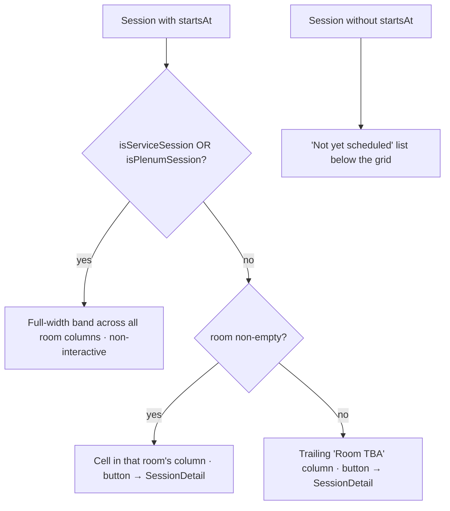

## feat: add agenda timetable page from Sessionize schedule - Standard

## Overview

Add a new `/agenda` page that renders DevFest.cz 2026 as a **proportional
(minute-accurate) time × room timetable** on desktop, collapsing to a
**time-ordered list** on mobile. Breaks, lunch, registration, and the keynote
render as **full-width bands** spanning all room columns; regular talks sit in
their room column, positioned and sized by their real start→end time. Tapping a
**talk** opens the existing `SessionDetail` modal (bands are non-interactive — see
the band rule). The page complements the existing `/sessions` browse page (search
+ filter) rather than replacing it, and the two cross-link.

All data already flows into the site: the daily `refreshSessionize` Cloud
Function mirrors Sessionize → Firestore `sessions`/`speakers`, served by the
CDN-cached `/api/lineup` endpoint and fetched client-side. **No new data source,
no new endpoint, no Cloud Function change.** The scheduling fields
(`startsAt`, `endsAt`, `room`, `isServiceSession`, `isPlenumSession`) are already
persisted on `SessionDoc` — the site just renders none of them today.

Web is **read-only**: no favoriting / "my schedule" (that lives in the mobile
app), so no accounts, auth, or persisted user state.

**Pre-schedule behavior:** the page and its nav link are **always live**. Session
times are empty in Sessionize until the org schedules (possibly weeks out), so the
island's own runtime states handle it — "Full schedule coming soon" (linking to
`/sessions`) until any session has a `startsAt`, then the grid. No build-time gate,
no separate page shell: a build-time fetch of production `/api/lineup` would make
`astro build` non-hermetic *and* would render the island-less shell during the
`A11Y_MOCK` build, leaving the grid un-auditable. The runtime empty state the
island already needs covers this for free.

Source brainstorm: [docs/brainstorm/2026-07-25-agenda-from-sessionize-brainstorm-doc.md](../brainstorm/2026-07-25-agenda-from-sessionize-brainstorm-doc.md)

## Problem Statement / Motivation

The site already knows *what* talks exist (`/sessions`) but never shows *when* or
*where*. Attendees planning their day need a timetable that lets them compare
parallel tracks at a glance — the core mental model of a conference schedule. The
scheduling data is present and unused; this is a presentation feature that unlocks
value already sitting in Firestore.

## Proposed Solution

A single new route `src/pages/agenda.astro` hosting one React island
`src/components/Agenda.tsx` (hydrated `client:load`, mirroring
`src/pages/sessions.astro` + `Sessions.tsx`). The island fetches the **unfiltered**
lineup (service + plenum sessions included), computes a day range and room
columns, and renders either the grid (desktop) or the list (mobile) from **one
shared, time-sorted data model**. Small additions to the browser data layer
(`src/lib/sessions.ts`, `src/lib/lineup.ts`) expose `isPlenumSession` and an
agenda-specific fetch that keeps service sessions.

### Band vs. cell rule (single documented predicate)



- **Band** = `isServiceSession || isPlenumSession`. Full-width, spans every room
  column, sits behind talk cells (`z-index`) if any talk runs in parallel.
  **Non-interactive** — breaks/lunch/registration carry empty `speakers`/
  `description`, so opening `SessionDetail` on them yields a near-empty dialog (and
  a `<button>` that opens an empty dialog is an a11y smell). Render bands as plain
  elements, not buttons. (The keynote is `isPlenumSession` with real content; if we
  later want it clickable, revisit — v1 keeps all bands non-interactive for one
  simple rule.)
- **Cell** = a talk (neither flag) with a `room` → placed in that room's column,
  as a `<button>` opening `SessionDetail`.
- **Room TBA** = a talk with `startsAt` but empty `room` → trailing "Room TBA"
  column (only rendered if any such session exists).
- **Not-yet-scheduled** = any displayable session with empty `startsAt` →
  rendered in a plain list under the grid so no talk is silently dropped (partial
  scheduling is the common real case).

### Time handling (highest-risk correctness area)

Sessionize `startsAt`/`endsAt` are **event-local ISO strings**
(`2026-10-30T09:00:00`, per `SessionDoc` comment). Rendering them through
`new Date(iso)` would reinterpret them in the *visitor's* browser time zone,
shifting the whole agenda for anyone not in Prague. Rules:

- Parse the wall-clock `HH:mm` and date **from the string** (regex/slice on the
  ISO components), never via `Date` local conversion.
- Grid position = minutes-from-day-start computed from those parsed components.
- If a `+hh:mm` offset is ever present, normalize to Europe/Prague explicitly with
  `Intl.DateTimeFormat(..., { timeZone: 'Europe/Prague' })`; **never** hard-code
  `+02:00` (Oct 30 2026 is after the Oct 25 DST switch → Prague is `+01:00`).
- Display a persistent "All times Prague (CET)" label on the page.
- **Verify the real wire shape** (offset vs. naive) against live `/api/lineup`
  before finalizing the parser — do not assume.

Pure helpers live in a new `src/lib/agenda.ts` (framework-free), isolating the
time math **for review clarity** — it is the highest-risk part of the feature, and
the codebase already isolates logic from islands this way (`src/lib/sessions.ts`).
This repo has **no test runner** (CLAUDE.md), so the actual correctness guard is
the manual Prague-vs-`America/New_York` verification in the Success Criteria, not
unit tests — the split keeps the math *reviewable*, not *tested*. Helpers:
`parseLocalMinutes(iso)`, `formatClock(iso)`, `dayRange(sessions)`,
`roomColumns(sessions)` (stable first-seen order), `partitionAgenda(sessions)` →
`{ bands, byRoom, roomTba, unscheduled }`, with a fallback 30-min duration when
`endsAt` is empty/invalid and a clamp on non-positive spans + a minimum visual
duration. (Same-room overlap splitting is **out of scope** — see Non-Goals.)

## Technical Considerations

**Architecture**
- Reuse over rebuild: mirror the `Sessions.tsx` four-state machine
  (`loading`/`ready`/`empty`/`error`), its `AbortController` cleanup, `role="status"`
  loader, and `role="alert"` error copy. Reuse `SessionDetail.tsx` verbatim for the
  modal (pass `session` + `speakersById` + `onClose`, same as `Sessions.tsx:243`).
- New browser fetch `fetchAgenda(signal)` in `src/lib/lineup.ts`: same `/api/lineup`
  read as `fetchLineup`, but sessions are filtered by a new `isAgendaSession`
  (title non-empty only) instead of `isDisplayableSession` — so service + plenum
  sessions survive. `fetchLineup` stays untouched so `/sessions` is unaffected.
  `isAgendaSession` intentionally diverges from `isDisplayableSession` by dropping
  the `!isServiceSession` clause; document why on both.
- Add `isPlenumSession: boolean` to the browser `Session` interface + coerce it in
  `sessionFromDoc` (`data.isPlenumSession === true`), with a JSDoc mirroring the
  server field (e.g. "Keynote/plenary — rendered as a full-width band, like service
  sessions"). It is already persisted on `SessionDoc`
  (`functions/src/sessionize/sessionize-api.ts:222`), so this is a **functions→src
  catch-up with no functions-side change** — but it is governed by the ⚠️
  `src↔functions` sync mandate at `src/lib/sessions.ts:11-14`; keep the shapes in
  sync. `roomId` stays out of the browser type (YAGNI — `room` string keys columns).

**Styling (brand mandates — not optional)**
- **4-font constraint** (`BaseLayout.scss`, user memory): a time grid tempts a
  condensed/tabular face — do not add one. All type uses `--font-*` variables
  (never a literal `'JetBrains Mono'` string — families resolve to build-time
  hashes). Time / room / clock-tick labels use `--font-jetbrains-mono` with
  `font-variant-numeric: tabular-nums` (see the `.index-no` primitive,
  `BaseLayout.scss:251`).
- **Design tokens:** all colors, rules, surfaces, spacing, and radii come from
  existing variables — `--panel/--panel-2/--panel-hover`, `--rule/--rule-soft/
  --rule-strong/--rule-red`, `--field-border` (WCAG-1.4.11-safe interactive
  border), `--color-accent/--color-accent-hot`, `--glow-red*`, `--radius`,
  `--gutter`, `--fs-*`. No new hardcoded hex/px. Reuse `.btn-ghost` for cross-links
  and `.eyebrow` for section labels rather than restyling.
- Mobile breakpoint: reuse the existing `(max-width: 760px)` literal that
  `Menu.astro:125` already keys mobile behavior on (no shared breakpoint token
  exists) rather than inventing a new value.

**Performance**
- One `/api/lineup` fetch on the island (CDN-cached; same call `/sessions` makes).
- Grid is CSS Grid with rows mapped to a 5-minute snap over the day range; no JS
  layout loop. Respect `prefers-reduced-motion` for any film-noir glow/reveal on
  cells.

**Security**
- No new inputs, endpoints, secrets, or writes. Read-only render of already-public
  session data. No App Check surface touched.

**Accessibility**
- Talk cells are real `<button>`s with `aria-label` = `"{title} — {clock}"` plus
  `" in {room}"` **only when room is non-empty** (bands and Room-TBA cells omit the
  dangling "in "). Bands are non-interactive elements with a text label.
- DOM/reading order is deterministic: sorted by (startsAt, room), identical to the
  mobile list order — the visual grid position is decorative only.
- Single-room day (one column) → render the list layout even on desktop so it never
  looks like a broken one-column grid.

## Implementation Phases

```implementation-phases
PHASE 1: Data layer + pure agenda helpers (non-visual; fully code-reviewable)  **Status:** Done
  - src/lib/sessions.ts: add `isPlenumSession` to `Session` (with mirroring JSDoc) + parse in `sessionFromDoc`; honor the ⚠️ src↔functions sync comment (no functions change — field already on SessionDoc). Add `isAgendaSession(session)` (title non-empty; keeps service/plenum), documenting its divergence from `isDisplayableSession`.
  - src/lib/lineup.ts: add `fetchAgenda(signal)` returning `{ speakers, sessions }` filtered by `isAgendaSession` (leave `fetchLineup` untouched).
  - src/lib/agenda.ts (new, framework-free): parseLocalMinutes(iso), formatClock(iso) — string-based, no Date TZ conversion; dayRange, roomColumns (stable first-seen order), partitionAgenda → { bands, byRoom, roomTba, unscheduled }; 30-min fallback when endsAt empty/invalid, clamp non-positive spans, minimum visual duration. No lane-splitting (single lane per room).
  - Verify against live /api/lineup: confirm `startsAt` wire shape (naive local vs. offset) and that `isPlenumSession` is present on real docs.
  DEPENDS ON: nothing

PHASE 2: Agenda island + page + nav link + cross-links  **Status:** Done
  - src/components/Agenda.tsx (+ Agenda.module.scss): four-state machine mirrored from Sessions.tsx; fetchAgenda; runtime empty states ("Schedule announced soon" when no sessions, "Full schedule coming soon" + /sessions link when sessions exist but none timed); desktop CSS-Grid proportional grid (rooms × 5-min snap), full-width non-interactive bands (z-index under cells), Room-TBA column, "Not yet scheduled" list; single-room → list layout; mobile (<=760px) → time-ordered room-labeled list. Talk cells are <button> opening SessionDetail. "All times Prague (CET)" label. 4-font + design-token mandates above; prefers-reduced-motion honored.
  - src/pages/agenda.astro: BaseLayout + SubpageHero (static seoHeading) + <Agenda client:load /> + <noscript> note (pattern from sessions.astro).
  - src/components/Menu.astro: add the "Agenda" link to the `links` array, adjacent to `/sessions` (always visible — page degrades gracefully).
  - Reciprocal cross-links: "See the schedule →" on /sessions, "Browse all talks →" on /agenda (reuse .btn-ghost).
  DEPENDS ON: Phase 1

PHASE 3: a11y harness coverage + full verification
  - scripts/a11y.mjs: add `/agenda/` to the `PATHS` array; add a `MODAL_FLOWS['/agenda/']` entry that opens a grid cell and re-runs axe scoped to [role="dialog"].
  - scripts/a11y-mocks/fixtures.mjs: add TIMED sessions (multi-room + at least one service/plenum band, so the fetchLineup-drops / fetchAgenda-keeps divergence is exercised); fix the stale file header that still describes the old firebase/firestore onSnapshot aliasing (data now serves over /api/*).
  - Run build + a11y + the manual matrix (desktop grid, mobile list, single-room degrade, partial-schedule, empty/coming-soon, deep-link, modal, TZ label, keyboard/SR order).
  DEPENDS ON: Phase 2
```

## Success Criteria

```success-criteria
GOAL: A read-only /agenda timetable renders the Sessionize schedule as a proportional time × room grid (desktop) / time-ordered list (mobile), with correct Prague-local times, reusing existing lineup data and the SessionDetail modal, and self-showing a "coming soon" state until at least one session is scheduled.

SUCCESS CRITERIA:
- Production build compiles with the new page, island, and data-layer changes | verify: npm run build
- Accessibility audit passes with /agenda in PATHS and timed-session fixtures covering the grid + modal flow | verify: npm run a11y
- `fetchLineup` (the /sessions path) still filters out service sessions — regression guard that only `fetchAgenda` keeps them | verify: manual 1) grep `isDisplayableSession` in src/lib/lineup.ts 2) confirm fetchLineup still calls it and fetchAgenda uses isAgendaSession instead
- Desktop grid places talks in room columns proportional to start→end; breaks/lunch/keynote render as full-width, non-interactive bands | verify: manual 1) npm run dev 2) open /agenda with scheduled fixture data 3) confirm columns per room, cell heights scale with duration, service/plenum rows span full width and are not buttons
- Times render in Europe/Prague regardless of the visitor's browser zone | verify: manual 1) set OS/browser TZ to America/New_York 2) reload /agenda 3) confirm clock times are unchanged (Prague wall-clock) and a "Prague (CET)" label is visible
- Mobile viewport collapses the grid to a time-ordered, room-labeled list | verify: manual 1) open /agenda at <=760px 2) confirm single-column time-ordered list, each item labeled with its room
- Tapping a talk opens the existing SessionDetail modal; bands are not interactive | verify: manual 1) click a talk cell -> SessionDetail opens with the correct session and closes/restores focus 2) confirm a lunch/break band is not focusable/clickable
- Always-live pre-schedule: with no timed session the island shows "coming soon" + a /sessions link; the grid appears once data has times; /agenda never 404s and the build makes no network call to production | verify: manual 1) load unscheduled fixture -> coming-soon state, nav link present 2) load scheduled fixture -> grid renders 3) confirm no build-time /api/lineup fetch was added
- Partial scheduling: timed sessions appear in the grid while untimed displayable sessions appear in a "Not yet scheduled" list (none dropped) | verify: manual 1) load mixed fixture (some startsAt empty) 2) confirm untimed talks listed below the grid
- Reciprocal cross-links exist between /agenda and /sessions | verify: manual 1) open /sessions -> schedule link present 2) open /agenda -> browse-all-talks link present
- No fifth font family and no hardcoded hex/px introduced in Agenda.module.scss | verify: manual 1) grep Agenda.module.scss for literal font-family strings and raw #hex / px colors 2) confirm only --font-* and design-token vars are used

NON-GOALS:
- Favoriting / "my schedule" / any per-user state (lives in the mobile app)
- Accounts, auth, or write access
- Same-room overlap lane-splitting — conference rooms run sequentially; parallel tracks are different rooms. Ship single-lane-per-room; add splitting only if real data ever shows same-room overlap (fast-follow)
- Build-time nav gate / hiding the page before scheduling (always-live + runtime empty state instead)
- Live "now / next" current-time indicator (fast-follow)
- Add-to-calendar / ICS / per-session share URLs (fast-follow)
- On-grid track filtering or color legend (filtering stays on /sessions)
- Multi-day grouping/tabs (2026 is single-day; revisit only if data shows >1 day)
- Any Cloud Function / Sessionize sync / /api endpoint change

VERIFICATION COMMAND: npm run build && npm run a11y
```

## Success Metrics

- Attendees can see the full timetable and compare parallel tracks on both desktop
  and mobile.
- Zero time-zone complaints (times match the printed program for all visitors).
- No regression to `/sessions` (same list, same filters, service sessions still
  hidden there).

## Dependencies & Risks

- **Time-zone wire shape (highest risk):** the parser depends on whether
  Sessionize emits naive local strings or offsets. Verify against live
  `/api/lineup` in Phase 1; a wrong assumption silently shifts every time. Mitigate
  by parsing wall-clock from the string and pinning `Europe/Prague` for any
  offset-bearing value. The real guard is the manual Prague-vs-`America/New_York`
  check in the Success Criteria (no test runner exists), so keep the math in the
  pure `src/lib/agenda.ts` helpers to keep it reviewable.
- **Single-day assumption:** the grid is built for one day. Confirm 2026 is
  single-day (Oct 30); if a second day ever appears, day grouping is a follow-up.
- **Partial scheduling is the common real case:** Sessionize routinely has some
  sessions timed and others blank — the "Not yet scheduled" list keeps untimed
  talks visible so none are dropped mid-transition.
- **No automated tests in this repo:** correctness rests on `npm run build`,
  `npm run a11y`, and the manual matrix above.

## References & Research

- Page/island/noscript/SEO pattern: [src/pages/sessions.astro](../../src/pages/sessions.astro), [src/components/Sessions.tsx:87](../../src/components/Sessions.tsx)
- Reused modal: [src/components/SessionDetail.tsx](../../src/components/SessionDetail.tsx) (usage at [src/components/Sessions.tsx:243](../../src/components/Sessions.tsx))
- Data-layer changes: [src/lib/sessions.ts:34](../../src/lib/sessions.ts) (`Session`, `sessionFromDoc`, `isDisplayableSession`, ⚠️ src↔functions sync comment at :11), [src/lib/lineup.ts:36](../../src/lib/lineup.ts) (`fetchLineup` filter)
- Persisted schedule fields (source of truth): [functions/src/sessionize/sessionize-api.ts:209](../../functions/src/sessionize/sessionize-api.ts) (`SessionDoc`, incl. `startsAt`/`endsAt`/`room`/`isPlenumSession` at :222)
- Nav array + mobile breakpoint: [src/components/Menu.astro:18](../../src/components/Menu.astro) (`links`), [src/components/Menu.astro:125](../../src/components/Menu.astro) (`(max-width: 760px)`)
- Design tokens + `.index-no` tabular-nums primitive + `.btn-ghost`/`.eyebrow`: `src/layouts/BaseLayout.scss`
- a11y harness (`PATHS`, `MODAL_FLOWS`) + fixtures: `scripts/a11y.mjs`, `scripts/a11y-mocks/fixtures.mjs`
